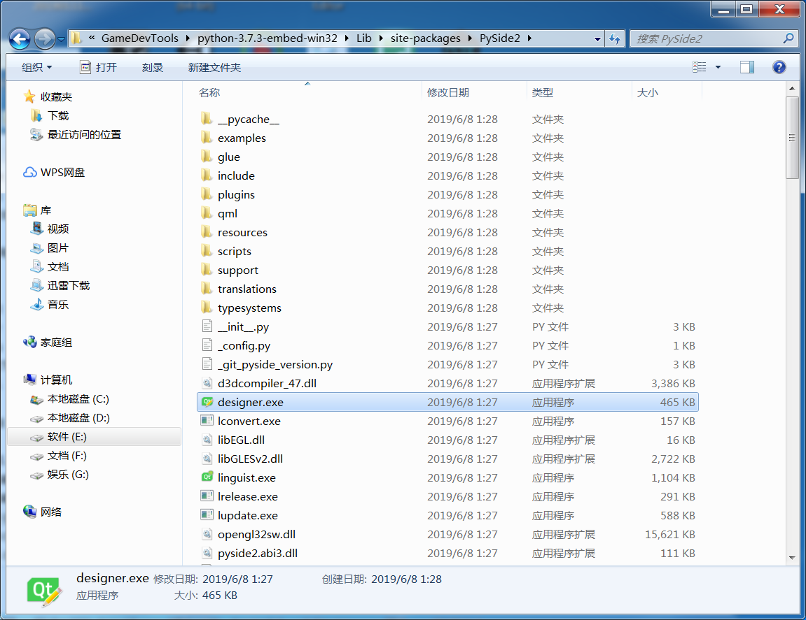
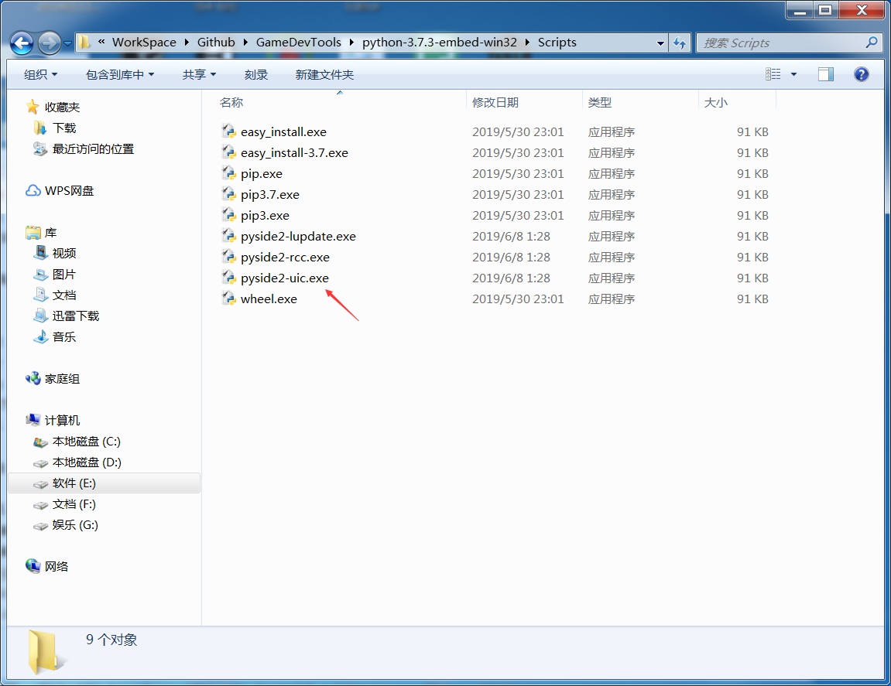
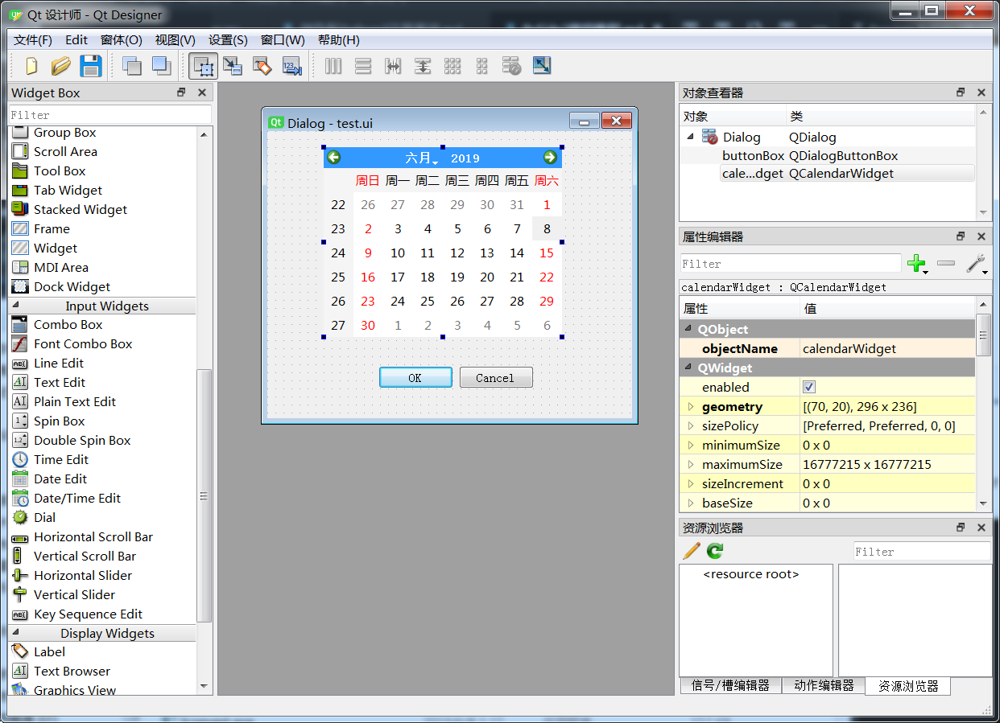
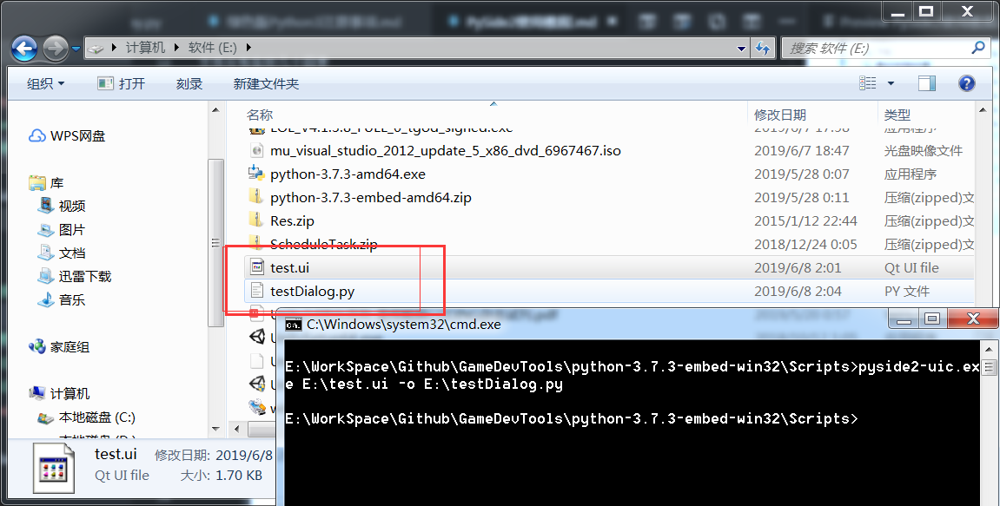
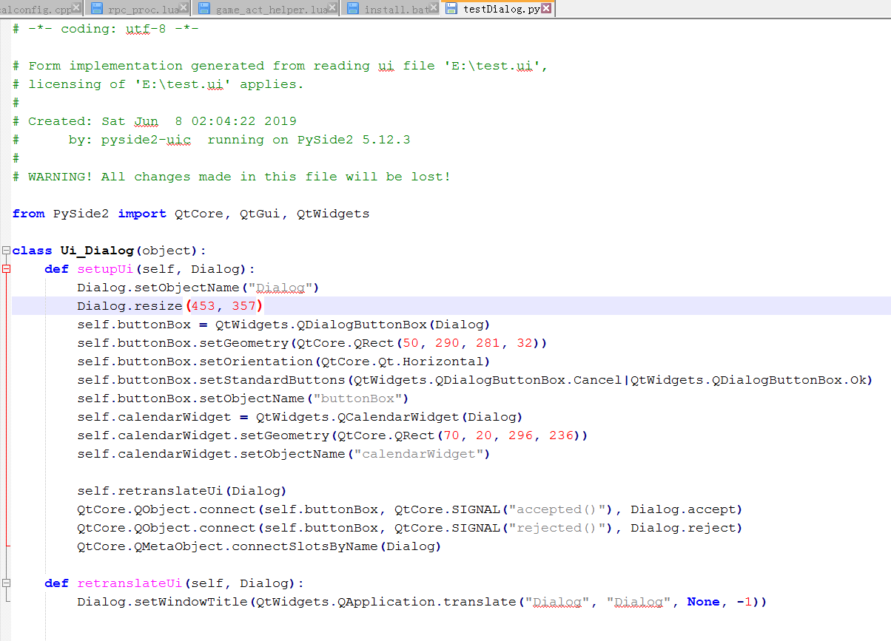
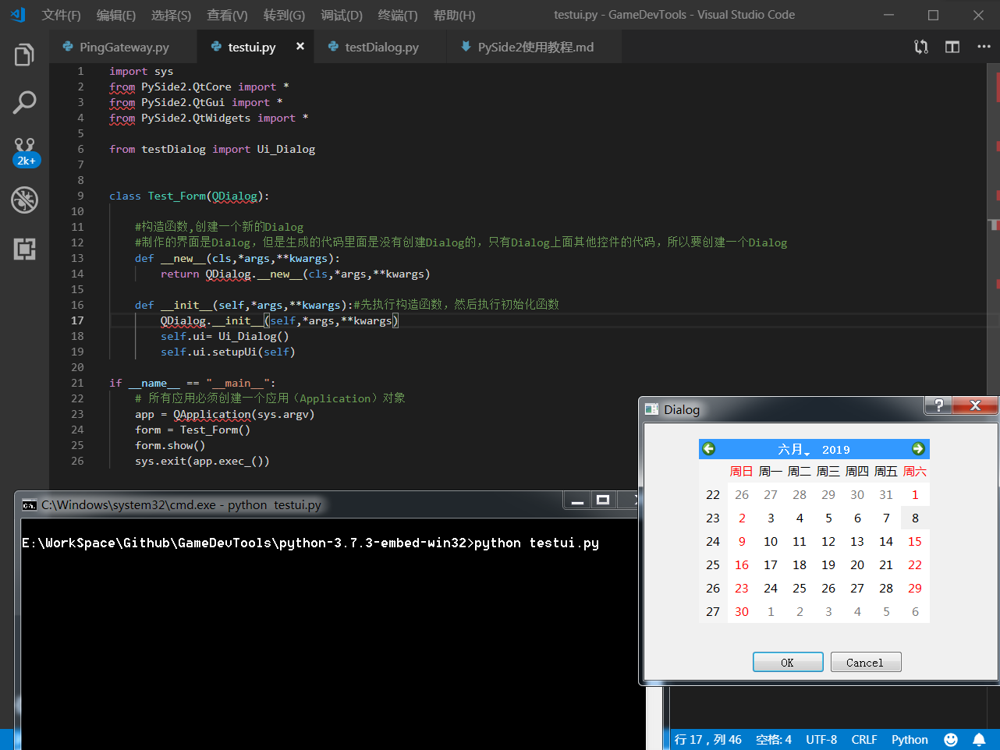

安装pyside2,需要在绿色版的文件夹右键打开命令行，然后执行下面命令

使用国内镜像加速

```
python -m pip install -i https://pypi.tuna.tsinghua.edu.cn/simple pyside2
```

文件分布在好几个目录

在 python-3.7.3-embed-win32\Lib\site-packages 目录里，有3个相关目录


在Pyside2 文件夹，存放了常用的Qt工具

    designer.exe 界面设计器

    linguist.exe 多语言工具




在 python-3.7.3-embed-win32\Scripts 目录里，有 UI 编译工具 pyside2-uic.exe，将 designer 制作好的界面文件 生成对应的 代码文件。



使用方法

首先使用 designer 制作一个界面



然后生成代码

```
pyside2-uic.exe C:\Users\crazy\Desktop\test.ui -o C:\Users\crazy\Desktop\test.py
```



如下内容



编写代码测试

```
import sys
from PySide2.QtCore import *
from PySide2.QtGui import *
from PySide2.QtWidgets import *

from testDialog import Ui_Dialog


class Test_Form(QDialog):

    #构造函数,创建一个新的Dialog
    #制作的界面是Dialog，但是生成的代码里面是没有创建Dialog的，只有Dialog上面其他控件的代码，所以要创建一个Dialog
    def __new__(cls,*args,**kwargs):
        return QDialog.__new__(cls,*args,**kwargs)

    def __init__(self,*args,**kwargs):#先执行构造函数，然后执行初始化函数
        QDialog.__init__(self,*args,**kwargs)
        self.ui= Ui_Dialog()
        self.ui.setupUi(self)

if __name__ == "__main__":
    # 所有应用必须创建一个应用（Application）对象
    app = QApplication(sys.argv)
    form = Test_Form()
    form.show()
    sys.exit(app.exec_())
```

效果


